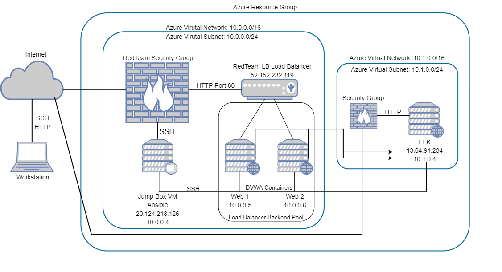

## Automated ELK Stack Deployment

The files in this repository were used to configure the network depicted below.

These files have been tested and used to generate a live ELK deployment on Azure. They can be used to either recreate the entire deployment pictured above. Alternatively, select portions of the *playbook* file may be used to install only certain pieces of it, such as Filebeat.

 - [Filebeat](ansible/filebeat.yml)
 - [Ansible Playbook](Ansible/pentest.yml)
 - [Ansible Hosts](Ansible/hosts.txt)
 - [Ansible Config](Ansible/ansible.cfg)
 - [Ansible ELK Install](Ansible/install-elk.yml)
 - [Filebeat Config](Ansible/filebeat-config.yml)
 - [Metricbeat Playbook](Ansible/metricbeat-playbook.yml)
 - [Metricbeat Config](Ansible/metricbeat-config.yml)

This document contains the following details:
- Description of the Topology
- Access Policies
- ELK Configuration
  - Beats in Use
  - Machines Being Monitored
- How to Use the Ansible Build

### Description of the Topology

The main purpose of this network is to expose a load-balanced and monitored instance of DVWA, the D*mn Vulnerable Web Application.

Load balancing ensures that the application will be highly **available**, in addition to restricting **access** to the network.
- Load balancers defend against denial of service attacks.
- Jumpbox serves as a gateway to gain entry into a remote network

Integrating an ELK server allows users to easily monitor the vulnerable VMs for changes to the **log files** and system *resources**.

- Filebeat is meant primarily to watch for system logs and forward any changes to the Elasticsearch Host.
- Metricbeat is used only for gathering metrics and system resources usage for display in Elasticsearch

The configuration details of each machine may be found below.

| Name      | Function            | IP Address | Operating System |
|-----------|---------------------|------------|------------------|
| Jump Box  | Gateway             | 10.0.0.4   | Linux            |
| ELK-SERVER| Web Server          | 10.1.0.4   | Linux            |
| Web-1     | WEb Server          | 10.0.0.5   | Linux            |
| Web-2     | ElasticSearch Stack | 10.0.0.6   | Linux            |

### Access Policies

The machines on the internal network are not exposed to the public Internet. 

Only the jumpbox machine can accept connections from the Internet. Access to this machine is only allowed from the following IP addresses:
- work station IP address

Machines within the network can only be accessed by the jumpbox host.
- Jumpbox
   Public IP 20.124.218.126
   Private IP 10.0.0.4

A summary of the access policies in place can be found in the table below.

| Name     | Publicly Accessible | Allowed IP Addresses |
|----------|---------------------|----------------------|
| Jump Box | No                  | Workstation Public IP|
| Web 1,2  | No                  | 10.0.0.4             |
| LB       | No                  | Workstation Public IP|
| ELK      | No                  | Workstation Public IP|

### Elk Configuration

Ansible was used to automate configuration of the ELK machine. No configuration was performed manually, which is advantageous because...
- It allows for full automation of a specific server and reduces configuration errors

The playbook implements the following tasks:
- Install Docker
- Install Python3_pip
- Docker Module:
- Increase Memory/Use More Memory
- Download and Launch ELK Container

The following screenshot displays the result of running `docker ps` after successfully configuring the ELK instance.

### Target Machines & Beats
This ELK server is configured to monitor the following machines:
- 10.0.0.5
- 10.0.0.6

We have installed the following Beats on these machines:
- Filebeat and Metricbeat on Web-1 and Web-2

These Beats allow us to collect the following information from each machine:
- Filebeats collect system type events like logins to monitor who is actively logging in
- Metricbeats collects useful information such as cpu usage and memory, this is particularly useful when seeing if there are any aberant programs or behaviors taking system resources

### Using the Playbook
In order to use the playbook, you will need to have an Ansible control node already configured. Assuming you have such a control node provisioned: 

SSH into the control node and follow the steps below:
- Copy the **elk.install.yml** file to /etc/ansible/elk_install.yml**.
- Update the hosts file to include the attribute, such as **[elk]**, then include your destination ip of the ELK server
- Run the playbook, and navigate to  **http://[your_elk_server_ip]:5601/app/kibana** to check that the installation worked as expected.
- Copy install_elk.yml to /etc/ansible/install_elk.yml in your Jumpbox Ansible Container
- Run Playbook: ansible-playbook /etc/ansible/install_elk.yml
- Navigate to **http://[your_elk_server_ip]:5601/app/kibana** in order to check that the ELK server is running
